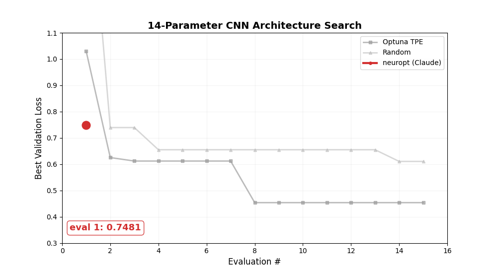

# Examples

## CNN architecture search (FashionMNIST)

Full search over 14 parameters — architecture and training hyperparameters.

```bash
neuropt run examples/train_fashion.py --backend claude
```

Source: [`examples/train_fashion.py`](https://github.com/loevlie/neuropt/blob/main/examples/train_fashion.py)

Searches over: block count, channel width, channel growth, kernel size, activation, residual connections, batch norm, dropout, pooling strategy, FC head size, learning rate, weight decay, optimizer.

## ResNet fine-tuning with model introspection

Give it a pretrained ResNet — neuropt auto-detects what to tune.

```bash
neuropt run examples/train_resnet.py --backend claude
```

Source: [`examples/train_resnet.py`](https://github.com/loevlie/neuropt/blob/main/examples/train_resnet.py)

neuropt discovers activations, BatchNorm layers, pooling, and detects pretrained weights. It generates a search space including freeze strategies, learning rate, weight decay, and optimizer — no manual configuration needed.

## ViT fine-tuning

Same idea with a Vision Transformer:

```python
from neuropt import ArchSearch
from torchvision.models import vit_b_16, ViT_B_16_Weights

model = vit_b_16(weights=ViT_B_16_Weights.DEFAULT)

search = ArchSearch.from_model(model, train_fn, backend="claude", pretrained=True)
search.run(max_evals=20)
```

neuropt detects LayerNorm, MHA dropout, and pretrained weights. It adds fine-tuning strategies (head_only, last layers, full) alongside activation swaps and dropout tuning.

## Notebook usage

```python
from neuropt import ArchSearch

search = ArchSearch(
    train_fn=train_fn,
    search_space={"lr": (1e-4, 1e-1), "dropout": (0.0, 0.5), "activation": ["relu", "gelu", "silu"]},
    backend="claude",
)
search.run(max_evals=50)

print(search.best_config)
print(search.best_score)
```

Crash-safe and resumable — if the kernel dies, restart and call `search.run()` again. It picks up from the JSONL log.

## Longer experiments

Let it run for 200+ evals and watch the LLM converge. Here's a 200-eval run on the CNN architecture search — neuropt keeps improving well beyond where Optuna and random search plateau:


