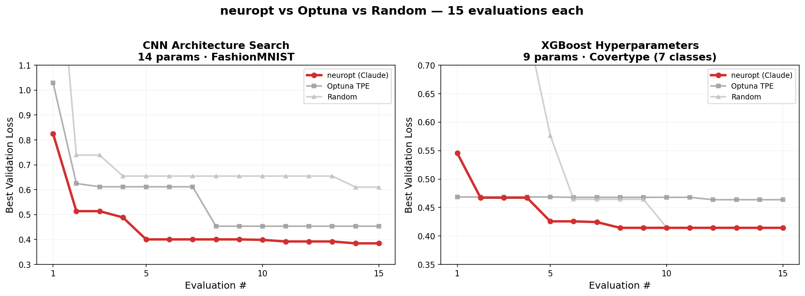

<div class="hero" markdown>


<p class="tagline">An LLM reads your training curves and designs your next experiment.</p>

```bash
pip install "neuropt[llm]"
```

</div>



<div class="benchmark-callout" markdown>

**Beats Optuna within 15 evals.** Same budget, same search space (14 params), same CNN training on FashionMNIST. neuropt reads per-epoch training curves and reasons about *why* configs work — not just which ones scored well. [See benchmarks](benchmarks.md) for details.

</div>

## Two ways to use it

=== "Option 1: Define a search space"

    ```python
    search_space = {
        "lr": (1e-4, 1e-1),                    # auto-detects log-scale
        "hidden_dim": (32, 512),                # auto-detects integer
        "activation": ["relu", "gelu", "silu"], # categorical
    }

    def train_fn(config):
        model = build_my_model(config["hidden_dim"], config["activation"])
        # ... train, return per-epoch losses for smarter LLM decisions ...
        return {"score": val_loss, "train_losses": [...], "val_losses": [...]}
    ```

=== "Option 2: Give it a model"

    ```python
    model = torchvision.models.resnet18(weights="DEFAULT")

    def train_fn(config):
        m = config["model"].to("cuda")  # deep copy with modifications applied
        # ... train ...
        return {"score": val_loss, "train_losses": [...], "val_losses": [...]}
    ```

    neuropt [walks the module tree](introspection.md) — activations, dropout, norms, pooling — and builds a search space automatically. For pretrained models, it adds [fine-tuning strategies](fine-tuning.md) too.

Then run:

```bash
neuropt run train.py                        # runs until Ctrl+C
neuropt run train.py --backend claude -n 50  # stop after 50
```

Or in a notebook:

```python
from neuropt import ArchSearch

search = ArchSearch(train_fn=train_fn, search_space=search_space, backend="claude")
search.run(max_evals=50)
```

<div class="feature-grid" markdown>

<div class="feature-card" markdown>
### Reads training curves
The LLM sees full per-epoch train/val loss, not just a final score. It spots overfitting, underfitting, and LR issues from curve shapes.
</div>

<div class="feature-card" markdown>
### Auto-introspects models
Give it a model and neuropt handles the rest — all the [introspection](introspection.md) and [fine-tuning](fine-tuning.md) logic happens under the hood. You don't need to know or configure any of it.
</div>

<div class="feature-card" markdown>
### Return anything
Your `train_fn` can return any metrics. Scalars become table columns, lists become per-epoch curves. The LLM sees everything.
</div>

<div class="feature-card" markdown>
### Crash-safe & resumable
Everything is logged to JSONL. Kill it, restart it, it picks up where it left off. Works overnight, works in notebooks.
</div>

</div>

## Works with

PyTorch models, XGBoost, LightGBM, Random Forest, any sklearn estimator. Supports Claude, OpenAI, and local Qwen backends.
